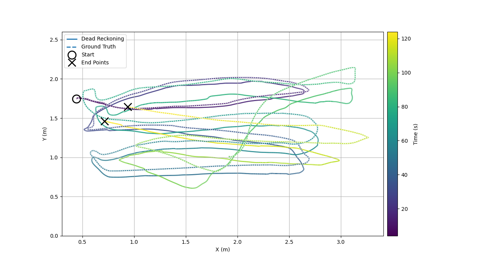

# ICRA2023_PatersonAdornoLennoxGroves

This repository houses the algorithm and csv datasets used in 'A Nonlinear
Estimator for Dead Reckoning of Aquatic Surface Vehicles Using an IMU and a
Doppler Velocity Log'.

The non-linear estimator used in the paper is given in `algorithm.py`. The file `demo.py` will plot dead reckoning vs ground truth trajectories similar to the ones found in the paper, and provides an intuition on how the algorithm may be used.

The datasets are located in the zip files `Data.zip` and `preprocessed.zip`, which are `git lfs` files. (Please see the instructions on [Cloning the repository](#cloning-the-repository) if `git lfs` is unfamliliar to you).

Datasets needed for `demo.py` are contained in `preprocessed.zip`. Raw data collected during the experiments is contained in `Data.zip`.

## Running the demo
The datasets for the demo are located in the zip file `preprocessed.zip`, which
is a `git lfs` file. (Please see the instructions on [Cloning the
repository](#cloning-the-repository).

Create a new virtual environment:
```
python3 -m venv venv
source venv/bin/activate
```
A `requirements.txt` file is provided. To install all the necessary modules with pip:
```
pip install -r /path/to/requirements.txt
```
Alternatively:
```
pip install numpy matplotlib dqrobotics pandas
```
Mac M1 users may have problems installing the dqrobotics library, or receive wrong architecture warnings when running the script. The following should fix that:
```
pip uninstall dqrobotics
python -m pip install 'dqrobotics @ git+https://github.com/dqrobotics/python.git'
```
Before running the script, ensure that demo.py is executable and that all the files `preprocesed.zip` have been properly extracated.

The script requires an experiment number from 1 to 10 (see [Experiment
Descriptions](#experiment-descriptions)) and can be run on the command line in
the usual way. For Linux and Mac users:
```
`./demo.py <number>`.
```

After the script executes you should see a plot such as:


## Experiment Descriptions
From the paper:
> A VICON motion capture system was used to record ground truth, orientation and position data of MallARD. The system consisted of 8 cameras mounted around a 2.4 m wide by 3.6 m long metallic pool. A custom VICON object was made and fitted to the rear of the robot, such that the VICON object frame is aligned with the DVL frame except for a displacement in the z axis. We assume this displacement to have a small effect due to the stability of MallARD in roll and pitch.

> The vehicle was tethered at all times to receive joystick commands and transfer data to a base station computer. MallARD runs on the Robotic Operating System (ROS), which was used to record data from the IMU and VICON bridge in rosbags. A Python script was used to capture raw JSON packets from the DVL.

An introductory video filmed at the side of the test pool before the experiments commenced is available [here](https://youtu.be/bSmQ6CvPZY4).

Below is a table detailing a short description for each experiment.


| Number | Name | Experiment Description |
|:- |:---- |:-----------------------|
| 1 | 03_xdata| Driving MallARD in ±x directory w.r.t the world and body frames. |
| 2 | 04_ydata| Driving MallARD in ±y directory w.r.t the world and body frames.|
| 3 | 05_yawdata| Controlling MallARD using primarily the yaw joystick. i.e. stationary rotations in the pool. Recording of experiment is available [here](https://youtu.be/e5fJocezanA)|
| 4 | 06_squaresfixedyawdata| Driving MallARD in square laps of the pool with fixed yaw.|
| 5 | 07_velxydata| Driving MallARD in squares with velocity in the body frame's x direction, followed by squares with velocity in the body frame's y direction|
| 6 | 08_fig8fixedyawdata| Driving MallARD in figure of 8s with fixed yaw.|
| 7 | 09_fig8velxydata| Driving MallARD in figure of 8s with velocity in the body frame's x direction, followed by squares with velocity in the body frame's y direction |
| 8 | 10_fig8velxydata| Repeat of previous experiment|
| 9 | 11_rnd_drive_data| Drive MallARD around the pool in freestyle or arbitrary manner for approximately 10 minutes |
| 10 | 12_all| Repeat experiments 3-9 in one bag for approximately 10 minutes|

## Cloning the repository
`git lfs` is required to successfully clone the datasets. To check whether `git lfs` is installed enter the following command into the terminal:
```
git lfs
```
If it not installed, git will give the following error:
```
git: 'lfs' is not a git command. See 'git --help'.

The most similar command is
	log
```
`git lfs` can be downloaded [here](https://git-lfs.github.com/). Alternatively on Debian
based systems:
```
sudo apt update
sudo apt install git-lfs
```
Clone the repo
```
git clone https://github.com/EEEManchester/ICRA2023-PatersonAdornoLennoxGroves
```
If you have already cloned the repo prior to installing `git lfs`, you will need to:
```
git lfs pull
```
